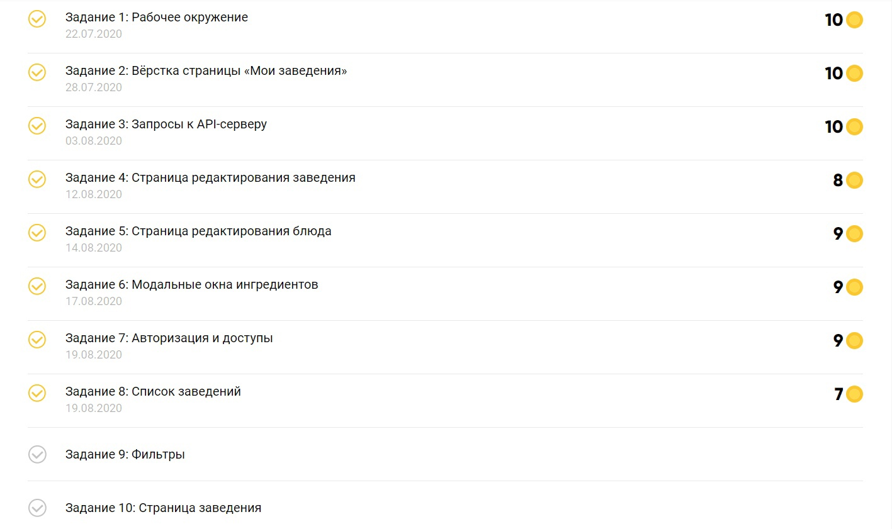
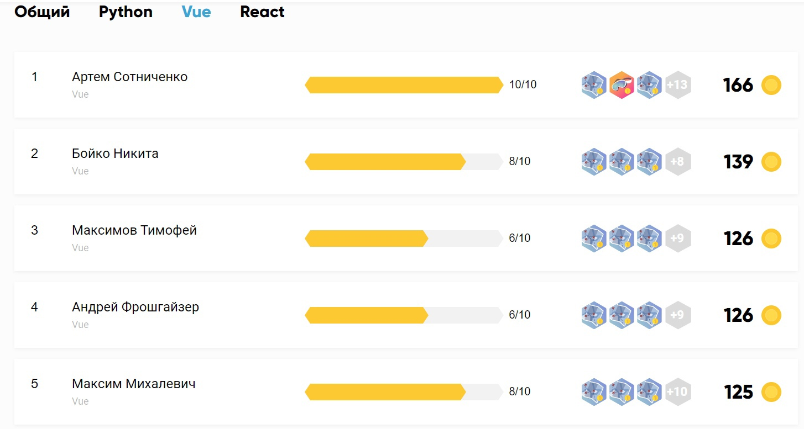

# :hammer_and_wrench: Производственная практика <a href="https://practice.sibdev.pro/">Sibdev</a>

## 📃 Краткое описание

### Практика делилась на два этапа:
- Первый этап - это решение алгоритмических задач.
- Второй этап - создание приложения, функционалом которого является поиск ближайших заведений общественного питания.

### Правила:
- На первом этапе было десять задач, сложность которых увеличивалась от первой к десятой. Решение восьми задач открывало доступ ко второму этапу. Проверкой алгоритмических задач занимался бот, который начислял количество очков в зависимости от корректности выполнения задачи.
- Второй этап был разделен на десять задач. Проверкой и начислением баллов занимался наставник. За каждую задачу можно было получить от 5 до 10 баллов. Максимальный балл (9-10) можно было получить только с первым pull request. Если практикант набирал 5 и меньше баллов, то решение нужно было исправить. А в случае получения 6-8 баллов, практиканту давалась возможность добрать баллы исправив решение. 

 ## Результат:

 
## Примечание 
Так как доступ к серверу давался только на время практики, возможности потестить проект локально больше нет. Но можно посмотреть структуру кода и код в целом, проект находится здесь https://github.com/NakkuTricks/cafe-finder
